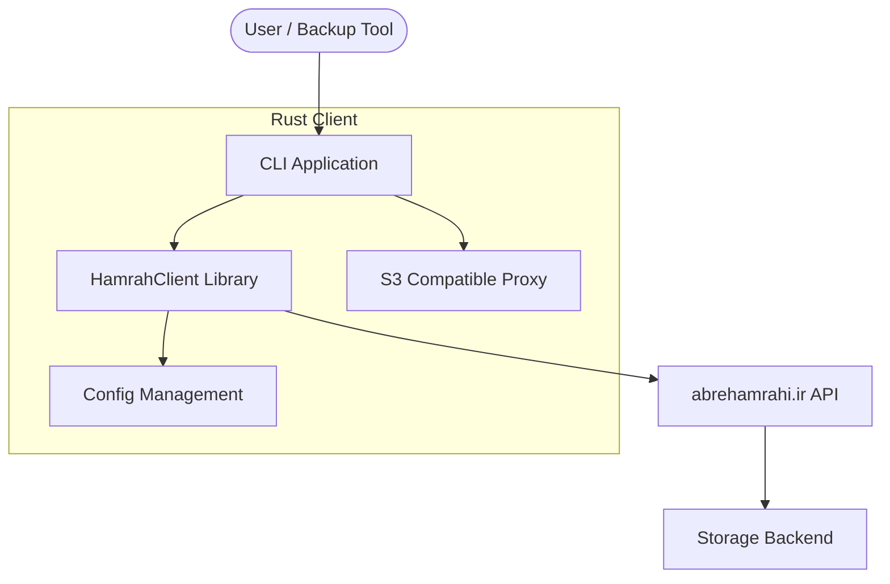
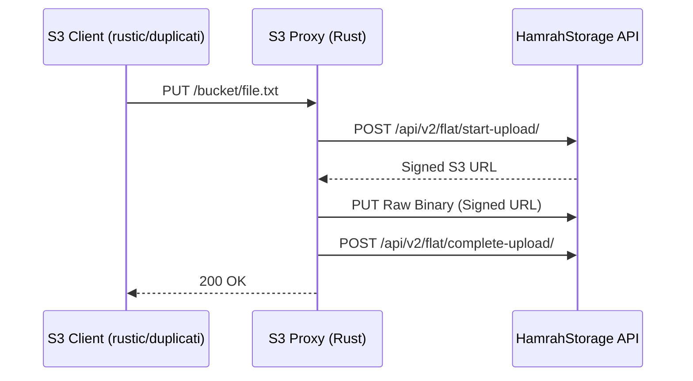

# HamrahStorage Rust Client Design Document

This document describes the architecture and design of the native Rust client for HamrahStorage (`abrehamrahi.ir`).

## 1. High-Level Architecture

The system consists of a core library (`lib.rs`) that encapsulates the reverse-engineered API logic and a CLI application (`main.rs`) that provides a user interface for various operations.



## 2. Component breakdown

### 2.1 HamrahClient (lib.rs)
The core library responsible for:
- **Authentication**: JWT-based login using phone and password.
- **File Operations**: Listing, uploading, and deleting objects.
- **Link Management**: Creating and managing public sharing links.
- **Contact & Sharing**: Managing contacts and setting private file permissions.

### 2.2 S3-Compatible Backend (s3_backend.rs)
A translation layer that implements the S3 protocol using the `s3s` crate. It maps S3 operations (like `ListObjectsV2` and `PutObject`) to HamrahStorage API calls.



### 2.3 Configuration (config.rs)
Handles multi-account support through a YAML configuration file. This allows the client to manage multiple credentials and switch between them seamlessly.

## 3. Features

### 3.1 Proxy Support (Optional)
The client supports an optional HTTP proxy (e.g., Fiddler, Charles, or a VPN proxy). If the `proxy` field is omitted from the configuration, the client connects directly to the server.

### 3.2 Cross-Platform Compatibility
The project uses GitHub Actions to compile binaries for:
- **Linux** (x86_64-unknown-linux-gnu)
- **Windows** (x86_64-pc-windows-msvc)
- **macOS** (Apple Silicon & Intel)

## 4. Usage with Backup Tools

By starting the S3-compatible server, you can point tools like `rustic` or `duplicati` to `http://localhost:8080` as their S3 endpoint.

```bash
# Example rustic command
rustic -r s3:http://localhost:8080/my-backup init
```
