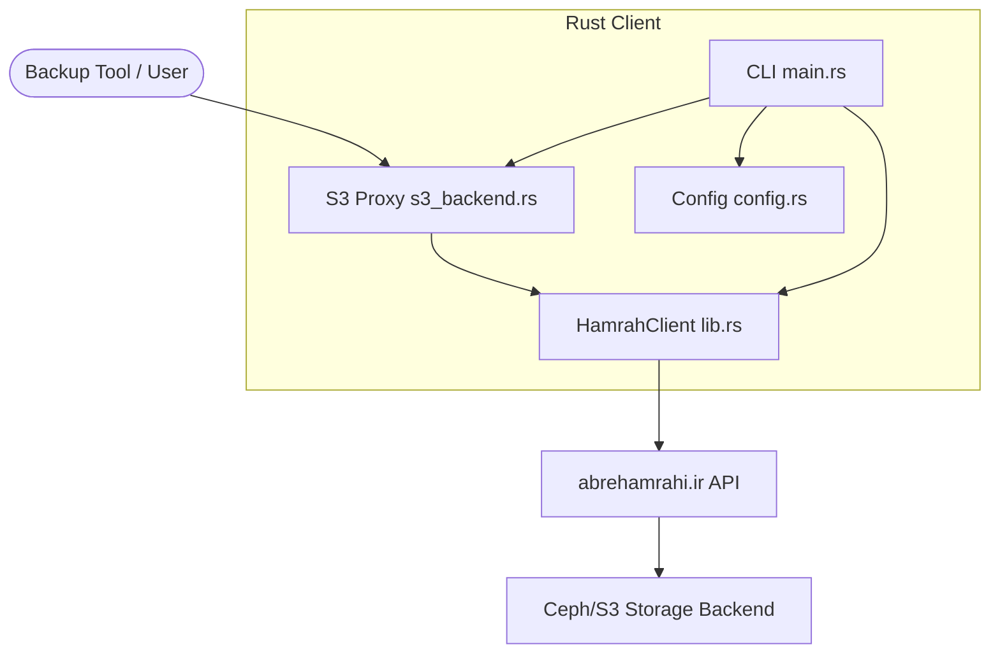
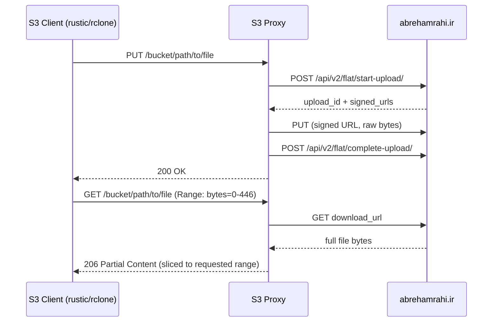

# HamrahStorage Rust Client Design Document

This document describes the architecture and design of the native Rust client for HamrahStorage (`abrehamrahi.ir`).

## 1. High-Level Architecture

## 2. Components

### 2.1 HamrahClient (`lib.rs`)
Core HTTP client wrapping the reverse-engineered Hamrah API:
- **Authentication** — JWT login via phone/password; tokens saved to `.session_<phone>` and reloaded on startup. Auto-refreshes on 401/503.
- **Upload** — 3-step S3 multipart flow: `start-upload` → parallel part PUTs → `complete-upload`. Uses `force_overwrite: true` for safe content-addressed re-uploads.
- **Download** — fetches objects via their `download_url` from the listing response.
- **List** — `GET /api/v2/flat/list-objects/` with 30-second in-memory cache per bucket to reduce API calls.
- **Delete** — moves objects to trash via `DELETE /api/v2/rgw/trash-objects/`.
- **Sharing** — public link creation/edit/delete and private contact-based permissions.

### 2.2 S3-Compatible Backend (`s3_backend.rs`)
Implements the `s3s::S3` trait to translate S3 protocol calls into Hamrah API calls.

Key design decisions:

**Path encoding** — Hamrah stores files flat (no directories). S3 keys containing `/` are percent-encoded: `/` → `%2F`, `%` → `%25`. This is transparent to S3 clients and backward-compatible with plain filenames.

**Byte-range support** — rustic and restic use random-access byte-range GET requests to read individual blobs from pack files without downloading the full pack. The proxy downloads the complete file from Hamrah and slices to the requested range before responding, setting `Content-Range` and `Content-Length` correctly.

**Listing cache** — object listings are cached for 30 seconds per bucket to avoid hammering the Hamrah API on tools that issue many HEAD/LIST requests in sequence. The cache is invalidated on any write or delete.

**Multipart assembly** — large S3 multipart uploads (from rclone or mc) are buffered in memory across `UploadPart` calls and assembled into a single `upload_bytes` call on `CompleteMultipartUpload`.

### 2.3 Configuration (`config.rs`)
YAML config with environment variable expansion (`${VAR}` syntax). Phone numbers are normalised at load time (strips leading `0`, `+98`, `98`). The `mc` section is optional and only used to print a ready-to-paste `mc alias set` command on startup.

## 3. S3 Operations Implemented

| Operation | Notes |
|---|---|
| `ListObjectsV2` | prefix + delimiter filtering for common-prefix grouping |
| `ListObjects` (v1) | same filtering, used by rclone |
| `HeadObject` | size, etag, last-modified from listing cache |
| `GetObject` | byte-range slicing via `Range` header |
| `PutObject` | directory markers (trailing `/`) silently acked |
| `DeleteObject` | single object delete |
| `DeleteObjects` | bulk delete; missing keys treated as success (S3 semantics) |
| `CreateMultipartUpload` / `UploadPart` / `CompleteMultipartUpload` | in-memory part buffering |
| `AbortMultipartUpload` | cleans up buffered parts |
| `HeadBucket` | checks if bucket name maps to a configured account |
| `GetBucketLocation` | returns default region |
| `CreateBucket` | no-op if bucket is a known account; error otherwise |

## 4. Compatibility Matrix

| Tool | Tested Operations | Status |
|---|---|---|
| rustic | init, backup, restore, forget, prune, snapshots | ✅ fully working |
| rclone | ls, copy, sync, cat, mkdir | ✅ fully working |
| mc | ls, stat, cp (upload+download), rm, mirror | ✅ fully working |

## 5. Cross-Platform Builds

GitHub Actions compiles release binaries for:
- Linux x86_64 (`x86_64-unknown-linux-gnu`)
- Windows x86_64 (`x86_64-pc-windows-msvc`)
- macOS Apple Silicon (`aarch64-apple-darwin`)
- macOS Intel (`x86_64-apple-darwin`)
